# Infraestructura de 4 Niveles: Aprovisionamiento con Vagrant
Infraestructura en 4 niveles: un balanceador web, un cluster de dos servidores web, un servidor NFS, un balanceador de base de datos, y un cluster de dos servidores de base de datos.

-----

## Índice

* [1. Arquitectura](#1-arquitectura)
* [2. Requisitos Previos](#2-requisitos-previos)
* [3. Configuración del Vagrantfile](#3-configuración-del-vagrantfile)
  * [3.1. ¿Qué es el Vagrantfile?](#31-qué-es-el-vagrantfile)
  * [3.2. Configuración](#32-configuración)
* [4. Script de Aprovisionamiento: MariaDB Galera Cluster](#4-script-de-aprovisionamiento-mariadb-galera-cluster)
  * [4.1. Declaración de Variables](#41-declaración-de-variables)
  * [4.2. Actualización e Instalación de MariaDB y Galera](#42-actualización-e-instalación-de-mariadb-y-galera)
  * [4.3. Configuración del Archivo Galera](#43-configuración-del-archivo-galera)
  * [4.4. Creación del Cluster, Usuario y Permisos](#44-creación-del-cluster-usuario-y-permisos)
  * [4.5. Importación del Archivo SQL](#45-importación-del-archivo-sql)
* [5. Script de Aprovisionamiento: Servidor NFS](#5-script-de-aprovisionamiento-servidor-nfs)
  * [5.1. Actualización e Instalación de NFS](#51-actualización-e-instalación-de-nfs)
  * [5.2. Creación de la Carpeta Compartida](#52-creación-de-la-carpeta-compartida)
  * [5.3. Configuración del Config.php](#53-configuración-del-configphp)
  * [5.4. Configuración de Exportaciones](#54-configuración-de-exportaciones)
  * [5.5. Configuración del /etc/php/8.2/fpm/pool.d/www.conf](#55-configuración-del-etcphp82fpmpooldwwwconf)
* [6. Script de Aprovisionamiento: Servidor Web (Nginx + PHP-FPM)](#6-script-de-aprovisionamiento-servidor-web-nginx--php-fpm)
  * [6.1. Actualización e Instalación de Nginx, PHP-FPM y Cliente NFS](#61-actualización-e-instalación-de-nginx-php-fpm-y-cliente-nfs)
  * [6.2. Montaje del Directorio Compartido](#62-montaje-del-directorio-compartido)
  * [6.3. Configuración de Nginx y Activación del Sitio](#63-configuración-de-nginx-y-activación-del-sitio)
* [7. Script de Aprovisionamiento: Balanceadores (Web y DB)](#7-script-de-aprovisionamiento-balanceadores-web-y-db)
  * [7.1. Configuración del Balanceador Web](#71-configuración-del-balanceador-web)
  * [7.2. Configuración del Balanceador de Base de Datos](#72-configuración-del-balanceador-de-base-de-datos)
* [8. Comprobación y Uso](#8-comprobación-y-uso)
* [9. Conclusión](#9-conclusión)

---

## 1\. Arquitectura.

La infraestructura se distribuye en siete máquinas virtuales, creando capas de aislamiento esenciales para la alta disponibilidad y la seguridad.

| Máquina | Función | IP |
| --- | --- | --- |
| **balanceadorCristina** | Balanceador Web | `192.168.10.5` |
| **server1Cristina** | Servidor Web | `192.168.10.10` `192.168.20.10` |
| **server2Cristina** | Servidor Web | `192.168.10.20` `192.168.20.20`|
| **serverNFSCristina** | Servidor NFS | `192.168.10.30` `192.168.20.30` |
| **proxyDBCristina** | Balanceador de Base de Datos | `192.168.20.5` `192.168.30.5` |
| **serverDB1Cristina** | Servidor de Base de Datos | `192.168.30.40` |
| **serverDB2Cristina** | Servidor de Base de Datos | `192.168.30.50` |
 
El tráfico se gestiona mediante tres subredes:

* red_www: utilizada por el balanceador y los servidores web servidos por el NFS.
* red_cluster: utilizada por los servidores web, NFS y el balanceador de base de datos.
* red_bd: utlizada por los servidores web y la base de datos para gestionar las peticiones MySQL.

El balanceador debe disponer de dos adaptadores de red: la NAT, que viene por defecto, para comunicarse con el exterior, y una red interna privada.

-----

## 2\. Requisitos Previos.

Se requiere tener instalados al menos los siguientes programas:

* **VirtualBox** (Software de virtualización). Descargar [aquí](https://www.virtualbox.org/wiki/Downloads).
* **Vagrant** (Herramienta para la creación y configuración de entornos de desarrollo virtualizados). Descargar [aquí](https://developer.hashicorp.com/vagrant/downloads).
* **Git** (Opcional, pero recomendado) para clonar este repositorio o obtener la carpeta db y src de [https://github.com/josejuansanchez/iaw-practica-lamp.git](https://github.com/josejuansanchez/iaw-practica-lamp.git).

La estructura de carpetas necesaria es la siguiente:

```bash
[Directorio]
├── Vagrantfile
├── balanceador.sh
├── proxyDB.sh
├── server_db.sh
├── server_nfs.sh
├── server_web.sh
├── db/
│   └── database.sql  (Database, tablas, usuarios)
└── src/
    └── index.php, config.php, etc. (El código de la aplicación)
```

A continuación, se explicará cómo configurar el Vagrantfile y detalles importantes de los cinco scripts de aprovisionamiento.

-----

## 3\. Configuración del Vagrantfile.


### 3.1\. ¿Qué es el Vagrantfile?

El `Vagrantfile` es un archivo de configuración para el entorno virtualizado. Define los parámetros de las máquinas virtuales (VMs), como la imagen base (`box`), las direcciones IP, los puertos, las carpetas compartidas, y las instrucciones de aprovisionamiento.


### 3.2\. Configuración.

La configuración se basa en la imagen `debian/bookworm64` para ambas máquinas virtuales, asegurando la consistencia del entorno.

Con `config.vm.box` se indica la imagen del sistema operativo; en este caso, Debian (Debian 12).

Para ambas máquinas, es necesario definir los siguientes parámetros que establecen la estructura de la arquitectura:

* `config.vm.define`: Define el nombre que se usará para referirse a la VM en los comandos de Vagrant (por ejemplo: `vagrant up crisalmmysql`).
* `vm.network "private_network", ip: ...`: Asigna una IP estática en una red privada.
* `vm.provision "shell"`: Indica la ruta del script (`path`) que se ejecutará automáticamente al arrancar la máquina. Con `args` se le da a conocer la IP de la otra máquina.

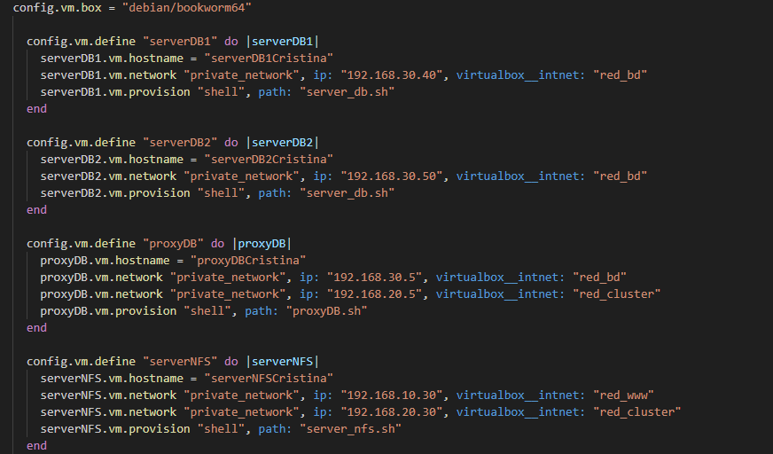
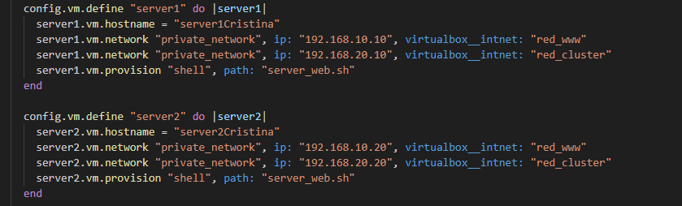

En el caso del balanceador, es imprescindible mapear un puerto para que el usuario acceda a la aplicación. 
* `vm.network "forwarded_port", guest: 80 , host: 8080`: Reenviar el tráfico del puerto de la máquina física (`host`) al puerto de la VM (`guest`).

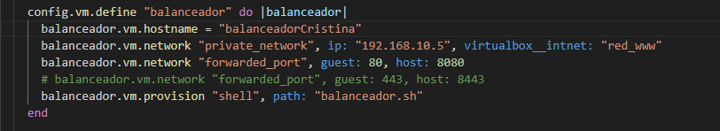

-----
    
## 4\. Script de Aprovisionamiento: MariaDB Galera Cluster.

Este script se encarga de instalar y configurar el cluster de base de datos.


### 4.1. Declaración de Variables.

Se definen variables para almacenar datos importantes que se repetirán en varias partes del script.

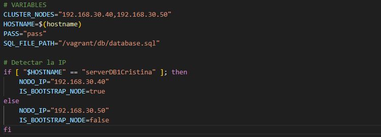


### 4.2. Actualización e Instalación de MariaDB y Galera.

Siempre se recomienda actualizar el sistema operativo primero, asegurando que tenga las versiones más recientes y estables del software. `-y` automatiza el proceso de confirmación.

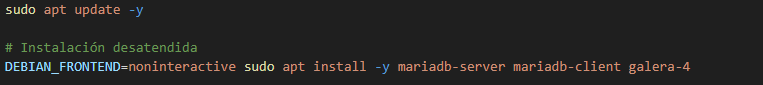


### 4.3. Configuración del Archivo Galera.

Se crea el archivo de configuración para la replicación en ambos nodos.

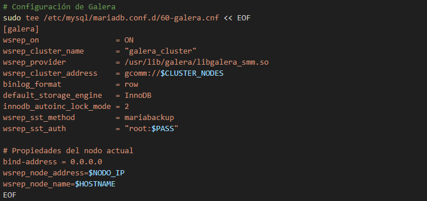

* `wsrep_cluster_address`: Lista de nodos a buscar para la unión/replicación.
* `wsrep_sst_auth`: Credenciales.
* `wsrep_node_address`: IP de la interfaz de replicación del nodo actual.

### 4.4. Creación del Cluster, Usuario y Permisos.

Con `galera_new_cluster` se crea un nuevo cluster. A continuación, se comienza la creación de usuarios.

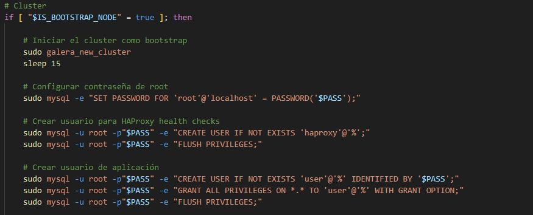


Es importante no olvidar que las sentencias SQL terminan siempre con `;`.


### 4.5. Importación del Archivo SQL.

Para finalizar, hay que importar el archivo `database.sql` que contiene las sentencias necesarias para la creación de la base de datos y las tablas que usará la aplicación. 

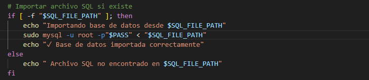

Este bloque `if` comprueba primero si la ruta es correcta y si el archivo existe. Después, le pasa el fichero a la base de datos (`sudo mysql -u root -p "$PASS" < "$SQL_FILE"`). Si falla, mostrará un mensaje de error.

Con esto, el script de aprovisionamiento de MySQL estaría completo.

-----

## 5\. Script de Aprovisionamiento: NFS.

Este script se encarga de configurar el almacenamiento compartido para el código de la aplicación.


### 5.1. Actualización e Instalación de NFS.


### 5.2. Creación de la Carpeta Compartida.

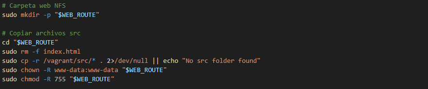

La variable `WEB_ROUTE` guarda la ruta `/var/www/html`.

El directorio `/var/www/html` necesita tener los permisos correctos para que el servidor web pueda leerlo y ejecutarlo. 

Con el comando `chmod -R 755` se asigna los permisos de lectura y escritura a los archivos dentro del directorio; el propietario tendrá el control total, y otros usuarios no podrán modificarlos. El usuario Nginx por defecto es `www-data`. El comando `chown -R www-data:www-data` cambia la propiedad de los archivos al usuario y grupo de Nginx.

### 5.3. Configuración del Config.php.

Con el comando `sed` se introducen los parámetros necesarios para el `config.php` con relación a la base de datos.

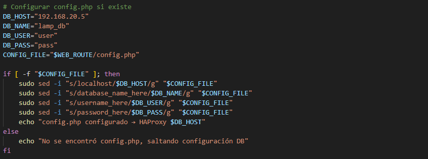

### 5.4. Configuración de Exportaciones.

Se modifica el archivo `/etc/exports` para compartir el directorio `/var/www/html` con los servidores web, especificando sus IPs.

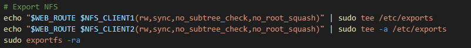


### 5.5. Configuración del /etc/php/8.2/fpm/pool.d/www.conf.

La ruta `/etc/php/8.2/fpm/pool.d/www.conf` está guardada en la variable `PHP_FPM_POOL`.

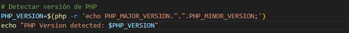
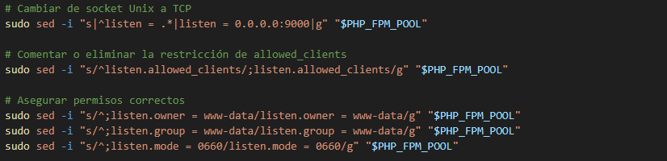

-----

## 6\. Script de Aprovisionamiento: Servidor Web.

Este script se encarga de configurar los nodos web.


### 6.1. Actualización e Instalación de Nginx, PHP-FPM y Cliente NFS.

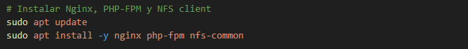

### 6.2. Montaje del Directorio Compartido.

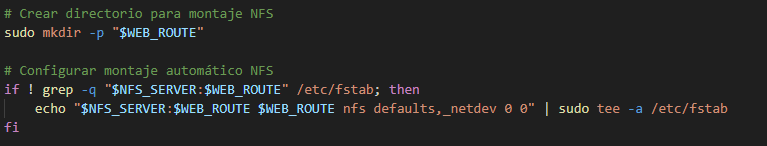

Hay que asegurarse de montarlo en `/etc/fstab` para automatizar el proceso cada vez que se reinicia la máquina.

### 6.3. Configuración de Nginx y Activación del Sitio.

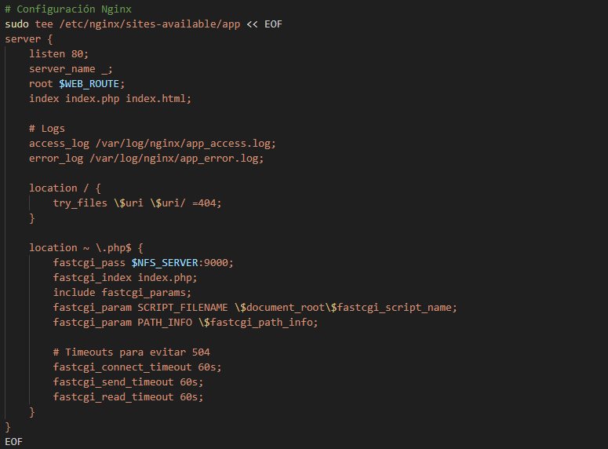
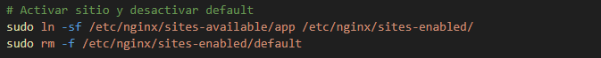

-----

## 7\. Script de Aprovisionamiento: Balanceadores (Web y DB).

En balanceador de base de datos, se instala HAProxy y Mariadb-client. En el balanceador web, se usa Nginx.

### 7.1. Configuración del Balanceador Web.

Escucha en el puerto 80 y dirige el tráfico a los servidores.

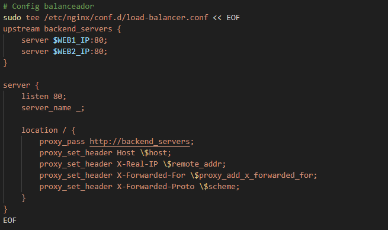

### 7.2. Configuración del Balanceador de Base de Datos.

Escucha en el puerto 3306 y dirige el tráfico a los nodos Galera.


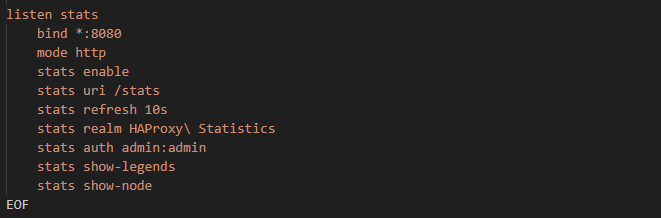

-----
## 8\. Comprobación y Uso.

Para levantar la arquitectura, simplemente se ejecuta el siguiente comando en el directorio raíz: `vagrant up`.

Una vez que ambas máquinas estén encendidas, para verificar el funcionamiento de la aplicación:

  1. En un navegador web, introducir la URL: `http://localhost:8080`. 
  2. Probar la aplicación. Introducir, visualizar y borrar datos para comprobar su correcto funcionamiento.

Enlace para ver el vídeo de comprobación: https://drive.google.com/file/d/1nB0XaLUVTqgf6-2d78MwdhnsQLuT-6b4/view?usp=sharing

## 9\. Conclusión.

El objetivo de esta práctica era diseñar y automatizar una arquitectura de cuatro niveles, altamente disponible y segura. Se ha logrado mediante el uso de Vagrant, junto con los scripts de aprovisionamiento, aislando las capas mediante tres subredes y utilizando HAProxy y MariaDB Galera Cluster para garantizar la continuidad del servicio ante fallos.
